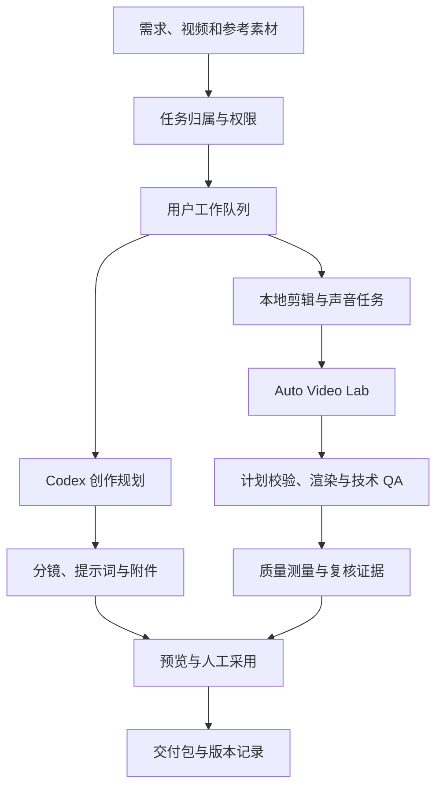

# 镜序 · AI 影像创作台

**把需求、参考素材、创作方案、自动剪辑和交付版本放进同一个任务。**

做一条短视频，真正费时间的经常是剪辑之外的工作：参考片在哪儿、这一轮要保留什么、哪个提示词版本被采用、模型为什么中断、配音和成片是不是同一版。多人共用一台机器时，还会多出排队、文件归属和资源争抢的问题。

镜序围绕这些问题做了一套本地工作台。前台负责上传、预览、任务操作和人工采用；后台负责创作规划、素材准备、模型调用和媒体处理。方案与附件按任务保存，最终交付可以追到使用的素材、指令和处理过程。

这个仓库展示的是一个以实际制作流程为中心的应用：Next.js / React 界面、TypeScript 服务逻辑、SQLite 数据、Codex 创作编排，以及 Python / FFmpeg 媒体底座共同工作。比较值得看的是任务背后的调度、上传恢复、生成输出校验和成片复核。

## 先看一个完整的制作场景

假设手头有产品素材、一个参考视频和一段制作要求：

```text
做一个竖屏产品演示。
参考片只借鉴动作顺序和镜头节奏，人物和环境使用自己的素材。
保留产品操作时的原声，补充英文字幕，最后整理可交付版本。
```

这段文字只是说明使用场景，下面是工作台组织任务的方式：

1. 上传产品与参考素材，明确文件归属，建立制作任务。
2. 整理参考输入的职责：哪些提供外观，哪些提供动作，哪些只是风格参考。
3. 创作路径生成分镜、提示词、素材上传次序与执行说明，供人审阅和采用。
4. 本地剪辑路径建立媒体任务，生成剪辑单，校验源区间、声音和叠加元素。
5. 调用媒体底座渲染，读取技术 QA 与质量测量，再准备复核证据。
6. 人工检查开头、字幕、切点和收尾，确认使用哪个版本，再整理交付包。

创作方案与本地成片是不同的输出。Seedance、可灵、Veo 等平台的生成仍由使用者在对应平台执行，不能把工作台产出的提示词当成已生成的视频。

## 工作台中有哪些能力

| 工作环节 | 代码提供的能力 | 留下的结果 |
| --- | --- | --- |
| 素材接收 | 视频上传会话、分片接收、组装、配额与取消清理 | 素材记录与上传状态 |
| 参考理解 | 视频证据、输入标签、素材职责与准备流程 | 参考证据与素材说明 |
| 导演方案 | 创作任务、输出规则、提示词与交付转换 | 分镜、提示词和附件版本 |
| 本地剪辑 | 剪辑计划、字幕、原声处理、视觉元素和渲染编排 | 剪辑单、成片与检查文件 |
| 声音准备 | 个人声音、配音任务、检查点与交付状态 | 对应任务的声音输出 |
| 局部处理 | 水印处理任务与批次合同 | 处理结果与范围说明 |
| 制作管理 | 账号权限、任务归属、指令历史与审计 | 可回看的任务过程 |
| 渠道记录 | 内容运营与排期数据 | 制作之后的运营记录 |

个人声音和高级媒体处理需要使用者另外准备模型、参考素材和运行环境。公开仓库保留实现，没有带入原工作环境的员工任务、声音样本和业务数据库。

## 架构：界面、任务与媒体执行



React 页面处理交互，服务端通过 `lib/` 中的业务模块管理任务。SQLite 保存用户、任务和上传会话等状态；任务过程文件由专门的存储模块组织。本地媒体能力由独立的 [Codex Auto Video Lab](https://github.com/h296025733-sys/codex-auto-video-lab) 提供，工作台不把全部音视频逻辑塞进页面接口。

这样拆分之后，创作输出规则、队列策略、上传会话和剪辑质量可以分别阅读与测试；媒体底座也能脱离 Web 界面独立使用。

## 调度：先保证用户轮转，再限制机器负载

### 同一用户串行，不同用户轮转

如果一个用户连续提交很多任务，直接使用先进先出队列，会让其他人的请求长期排在后面。`work-scheduler.ts` 在选择任务时先考虑用户：正在执行的用户暂时不再领取下一项，空闲用户按最近调度次序轮转。

选定用户后，再比较该用户的可执行任务：优先级、等待时间、任务类型和提交顺序共同决定下一项。同等级时尽量避免连续重复同一种工作；等待每增加五分钟，会提升有效优先级，降低长期等待的概率。

队列还提供有效性检查、待执行项目移除与执行中取消回调。任务已经失效时，不应该继续占用模型与本地进程。

### 工作并发与资源容量分开

“能同时处理几个用户任务”和“能同时运行几个 FFmpeg / 模型进程”是两件事。一个剪辑任务可能先等待模型，再进行转录、渲染和完整解码，负载在不同阶段变化。

因此工作队列之外，还有 Codex、本地媒体与声音容量模块。队列限制总任务数和部分工作类型，执行阶段再经过相应资源门槛。声音工作在队列中按单项容量处理，参考视频也有单独上限。

当前调度器在单个应用进程的内存中运行。SQLite 中有任务记录，不代表已经实现多机器的分布式队列；如果要扩展成多实例服务，还需要持久化领取、租约和跨进程资源协调。

## 上传：取消并不只是删除一个临时文件

视频上传有独立会话，状态包括接收、组装、完成和取消。接收中的分片可能仍有活动写入流；此时直接删除目录，会让后续流写入与清理发生冲突。

当前实现先持久化取消状态，再中止对应活动流。流退出后的清理逻辑负责收尾，过期与空会话清理也会检查是否仍在接收分片。用户归属和上传配额参与会话处理，不能只凭文件名决定谁可以操作。

相关代码拆为三部分：

| 部分 | 职责 |
| --- | --- |
| `video-upload-sessions.ts` | 会话状态、组装、取消与清理协调 |
| `video-upload-stream.ts` | 接收流和文件写入 |
| `video-upload-limits.ts` / `video-upload-client-policy.ts` | 容量、大小及客户端上传策略 |

任务与视频的管理权限采用创建者 / 上传者与管理员的判断。隐藏前端按钮只能改善界面，实际归属判断仍由服务端模块执行。

## 生成恢复：重试连接，校验内容

模型请求失败至少分两类。连接中断、临时服务错误等可以有限重试；授权失效、额度耗尽、主动取消和拒绝生成，需要停止并把原因交给用户处理。

`generation-recovery.ts` 对暂时性错误最多执行三次尝试，等待期间响应取消。结构不合格的输出走另一条恢复链：先做确定性的局部修正，再根据校验问题请求模型改写，模型修复轮数最多四次。

每个候选都要重新通过同一个校验器。检查点保存当前输出与问题，方便观察失败发生在哪一轮。恢复流程的目标是得到符合约定的结果，不能用“模型已经返回文字”代替“这份文字可用于后续处理”。

## 自动剪辑：计划检查与成片检查各自负责什么

### 保留原声时，不依赖语音识别决定全部声音

产品操作声、环境声和较轻的口播，未必会被 ASR 识别出来。如果用户要求保留原声，不能只保留被标为语音的那几秒。源素材保留模块会处理主素材声音与时间区间，并纠正会破坏原声要求的极低增益设置。

保留区间按源时间合并，遗漏部分单独记录。覆盖率说明素材有多少被使用，不能说明每个动作都表达清楚，语义与观感仍需要人工复核。

### 剪辑单先过约束，成片再测量

计划侧检查素材、片段、节奏变化、重复内容和声音约定。渲染后再读取实际文件，检查技术 QA，测量重复画面、音频切点等问题，并建立供复核的画面证据。

这两层解决的问题不同：一份合法计划可能渲染失败，一个能解码的文件也可能剪得不好。因此界面保留预览与采用动作，技术检查结果和人工复核结论分别记录。

## 任务与交付为什么要保留中间文件

一次任务可能经过理解、创作、翻译、剪辑和交付转换。只保存最终附件，出问题时很难知道错在输入、模型结果还是媒体执行。

`task-run-storage.ts`、指令历史和交付模块分别管理运行文件、用户修改与转换状态。配音还有检查点，避免后续处理混用不同轮次的声音。交付包转换有自己的取消与状态规则，不能把仍在转换的结果直接当作已完成附件。

这些记录让人能够回答：这一版依据哪些参考？采用过什么指令？剪辑单对应哪个任务？转换是否结束？至于素材本身是否符合业务意图，仍应回到画面与声音检查。

## 技术选型与本地运行

| 层 | 技术 | 用途 |
| --- | --- | --- |
| Web | Next.js、React、TypeScript | 页面、服务接口和交互 |
| 本地状态 | Node `node:sqlite` | 用户、任务、素材与会话记录 |
| 账号 | JWT、HTTP-only Cookie、权限模块 | 登录状态与资源归属 |
| 创作编排 | Codex | 参考理解与结构化创作输出 |
| 媒体执行 | Python 3.12、FFmpeg / ffprobe | 探测、剪辑、声音与技术检查 |
| Windows 辅助 | PowerShell | 本机环境与服务脚本 |

### 1. 先启动开发界面

使用支持 `node:sqlite` 的 Node.js 24+：

```powershell
npm ci
npm run typecheck
npm run dev
```

开发地址为 `http://127.0.0.1:3100`。自己的账号、数据库和本机密钥由本地配置建立，数据目录 `data/` 已被 Git 忽略。

### 2. 准备媒体底座

将 Auto Video Lab 放到相邻目录，按其 README 准备 Python、FFmpeg 与需要的模型。也可指定目录：

```powershell
$env:DW_AUTO_EDIT_LAB_ROOT = 'D:\projects\codex-auto-video-lab'
```

这只是示例目录，需要换成自己的实际位置。部分媒体路径校验沿用 Windows D 盘部署约束，首次配置时应对照 [本地准备说明](docs/local-setup.md) 与 `lib/codex-director.ts` 检查磁盘布局。

### 3. 配置自己的授权，再验证制作链路

真实创作需要自己的 Codex 授权，个人配音需要自己的声音素材与相应模型。建议先用一份较短的自有素材，逐项观察任务状态、计划文件、渲染结果和复核报告。

`scripts/start-server.ps1` 是服务运行辅助入口，涉及端口与进程处理；公开整理没有执行该脚本，也没有执行真实制作任务。

## 阅读代码的路线

| 想了解的问题 | 实现入口 | 对应测试入口 |
| --- | --- | --- |
| 多人排队怎样轮转 | [work-scheduler.ts](lib/work-scheduler.ts) | [work-scheduler.test.mjs](tests/work-scheduler.test.mjs) |
| 怎样区分工作并发与资源容量 | [concurrency-config.ts](lib/concurrency-config.ts)、[codex-capacity.ts](lib/codex-capacity.ts)、[local-media-capacity.ts](lib/local-media-capacity.ts) | [concurrency-resources.test.mjs](tests/concurrency-resources.test.mjs) |
| 上传中断后怎样清理 | [video-upload-sessions.ts](lib/video-upload-sessions.ts) | [video-upload-recovery.test.mjs](tests/video-upload-recovery.test.mjs) |
| 生成失败何时重试 | [generation-recovery.ts](lib/generation-recovery.ts) | [generation-recovery.test.mjs](tests/generation-recovery.test.mjs) |
| 原声与源区间怎样保留 | [auto-edit-source-preservation.ts](lib/auto-edit-source-preservation.ts) | [auto-edit-source-preservation.test.mjs](tests/auto-edit-source-preservation.test.mjs) |
| 剪辑质量怎样检查 | [auto-edit-quality-gates.ts](lib/auto-edit-quality-gates.ts)、[auto-edit.ts](lib/auto-edit.ts) | [auto-edit-quality-gates.test.mjs](tests/auto-edit-quality-gates.test.mjs) |
| 附件怎样转换成交付包 | [delivery-packages.ts](lib/delivery-packages.ts) | [delivery-package.test.mjs](tests/delivery-package.test.mjs) |

可以按兴趣运行仓库中已有的测试入口：

```powershell
npm run test:concurrency
npm run test:video-upload
npm run test:delivery-packages
npm run test:auto-edit
```

这些命令是复现入口，不代表公开整理时已经执行它们包含的所有用例。实际执行集合以检查记录为准。

## 验证范围与当前边界

2026-10-07 的公开源码检查执行了 TypeScript 检查、13 个选定 Node 测试文件中的 186 个隔离用例，以及相关脚本语法检查。测试使用隔离数据库等环境，覆盖调度、容量、上传恢复和部分剪辑合同。

没有执行完整 Next.js 构建、真实 Codex 请求、实际视频渲染、真实浏览器上传与配音的端到端流程。公开版也不含历史私有素材对应的验收结果。详细集合和限制见 [检查记录](docs/verification.md)。

当前架构适合在单机上组织制作任务。扩展为多人正式服务，需要另外验证持久化恢复、部署环境、容量参数和真实媒体负载；现有队列与技术测量不能直接证明生产规模或最终创作质量。
