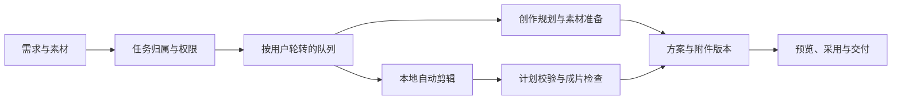

# 镜序 · AI 影像创作台

**从素材和创作需求，到方案、剪辑与交付版本的一套本地工作台。**

写需求、放参考片、整理提示词、剪视频、找最终版本，原本是分散的几步。镜序把它们收进同一个任务：前台处理素材预览和人工采用，后台安排模型调用与媒体处理，任务里保存过程文件和交付记录。

项目使用 Next.js、React、TypeScript 和 Node SQLite。它比较复杂的地方在后台：多人同时提交任务、上传中途断开、模型输出不符合约定，都会影响最终交付。

## 一个任务如何走到交付



创作规划输出分镜、视频提示词和素材上传顺序；自动剪辑路径调用 [Auto Video Lab](https://github.com/h296025733-sys/codex-auto-video-lab) 处理媒体。字幕、个人配音和水印处理有各自入口，渠道排期与运营记录也保留在工作台内。

## 几个关键设计

**任务公平与资源容量分开处理。** 同一用户的工作串行执行，不同用户按最近调度次序轮转；等待时间会影响优先级。任务队列之外，Codex、本地媒体和声音处理另有容量控制，避免把“用户可以提交多少任务”直接当成“机器可以同时跑多少进程”。

**上传取消要处理正在写入的流。** 视频上传有独立会话、分片和组装状态。取消先写入状态，再中止活动流；流的清理逻辑负责收尾，避免删除仍在接收的文件。配额与过期会话清理在同一条上传链路里处理。

**恢复后的模型输出仍需校验。** 网络中断与服务暂时不可用可以有限重试；授权失效、额度耗尽和主动取消会停止。格式修复和模型重写之后，候选结果仍要通过原来的校验器。

**剪辑质量从原片覆盖和实际输出两侧检查。** 当用户要求保留原声时，主素材中未被识别为语音的区间也应保留。计划记录保留与遗漏的源时间段，成片再检查重复片段、音频切点等指标；这些测量不能代替人看实际画面。

## 从这些代码开始

| 关注点 | 实现入口 |
| --- | --- |
| 公平队列、优先级与取消 | [work-scheduler.ts](lib/work-scheduler.ts) · [回归用例](tests/work-scheduler.test.mjs) |
| 模型、本地媒体与声音容量 | [codex-capacity.ts](lib/codex-capacity.ts) · [local-media-capacity.ts](lib/local-media-capacity.ts) · [voice-capacity.ts](lib/voice-capacity.ts) |
| 分片上传与异常清理 | [video-upload-sessions.ts](lib/video-upload-sessions.ts) · [上传恢复用例](tests/video-upload-recovery.test.mjs) |
| 生成输出修复与重试 | [generation-recovery.ts](lib/generation-recovery.ts) |
| 原片保留与质量门槛 | [auto-edit-source-preservation.ts](lib/auto-edit-source-preservation.ts) · [auto-edit-quality-gates.ts](lib/auto-edit-quality-gates.ts) |
| 交付包转换与任务状态 | [delivery-packages.ts](lib/delivery-packages.ts) |

## 本地开发

建议 Node.js 24+，需要支持 `node:sqlite`。公开版不含用户数据库、登录状态、上传素材和员工任务。

```powershell
npm ci
npm run typecheck
npm run dev
```

开发页面使用 `http://127.0.0.1:3100`。真正执行影像任务前，需要配置自己的 Codex 授权、本地 FFmpeg、Python 环境以及 `DW_AUTO_EDIT_LAB_ROOT`。依赖配置见 `docs/local-setup.md`。

创作方案需要使用者交给相应视频模型平台执行；工作台的方案输出不代表已经在 Seedance / 可灵 / Veo 完成生成。个人配音和媒体处理还受模型、硬件与素材条件限制。

## 本次公开整理的检查

见 [检查记录](docs/verification.md)，其中区分源码与语法检查、隔离测试和未执行的真实环境路径。
